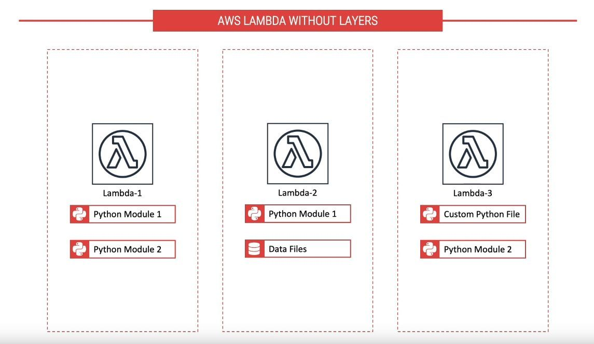
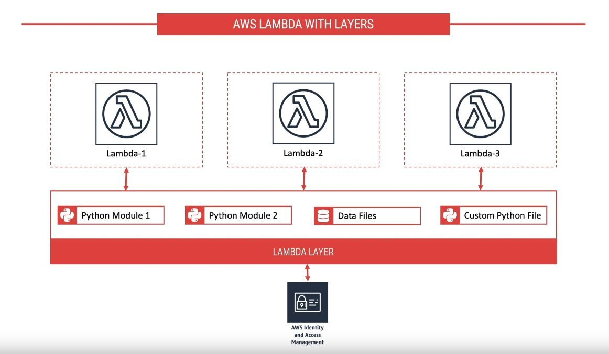
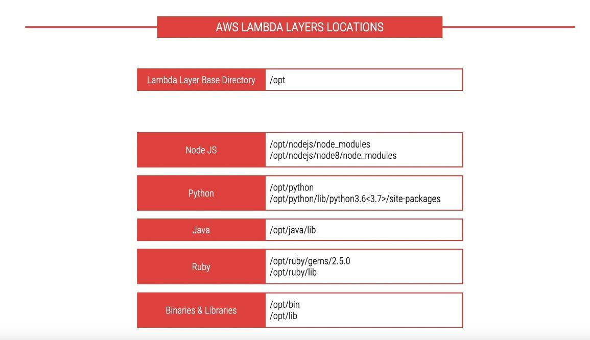
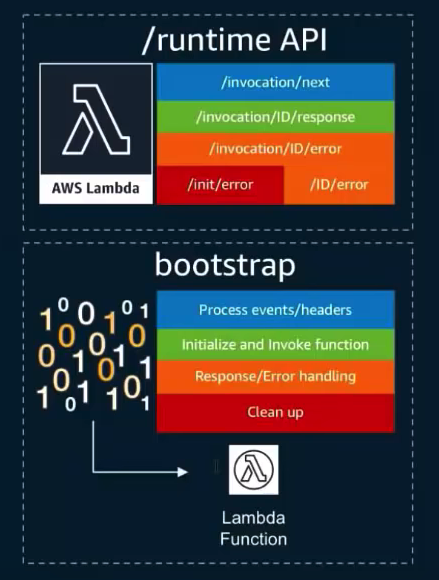
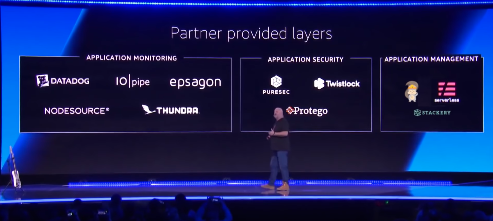

## 背景

AWS 在2018年11月推出两个新功能，声称将使无服务器开发变得更加容易：

- Lambda Layers：用于集中管理跨功能共享的代码和数据
- Lambda Runtime API，一个使用任何编程语言或特定语言版本的简单接口，用于开发函数，将 AWS Lambda 从 JavaScript 扩展到其他编程语言

这两个功能可以一起使用：Runtime可以作为Layer共享，以便开发人员可以在创建Lambda函数时选择它们并使用自己喜欢的编程语言。

## Lambda Layers

### Lambda Layers介绍

构建serverless应用程序时，通常会在Lambda函数之间共享代码。可以是由多个函数使用的自定义的代码，或者是用来简化业务逻辑实现的标准库。

以前，必须将此共享代码与所有使用它的函数一起打包和部署：



现在，您可以将常用组件放在ZIP文件中并将其作为Lambda Layer上传。您的函数代码不需要更改，并且可以像通常那样引用Layer中的库:



Layer可以帮助在函数间更方便的共享代码：Upload layer once，reference within any function！

而Layer可以包含任意内容，包括：依赖，数据，配置文件，实用工具等。

### Layer的优点

使用Layer可以使部署包保持较小，从而使开发更容易。可以避免在函数代码安装和打包依赖时可能发生的错误。对于Node.js，Python和Ruby函数，[在Lambda控制台中开发函数代码](https://docs.aws.amazon.com/lambda/latest/dg/code-editor.html)，可以将部署包保持在3 MB以下。

- 实现关注点分离：分离业务逻辑和依赖
- 使函数代码更小，更专注于想要构建的内容
- 加快部署速度，因为必须打包和上载的代码更少了，并且可以重用依赖

### Layer的使用方式

在函数的配置中，最多可以引用五个Layer，其中一个Layer可以选择是runtime。调用该函数时，将按照您提供的顺序在 /opt 中安装Layer。顺序很重要，因为Layer都是在同一路径下提取的，因此每个Layer都可能覆盖前一个Layer。这个方式可用于自定义环境。例如，第一个Layer可以是runtime，第二个Layer可以添加所需库的特定版本。



Layer可以在AWS账户内使用，在账户之间共享，也可以与开发人员社区公开共享。

**使用Runtime和Layer无需额外费用。**

使用方式：

```bash
$ aws lambda update-function-configuration --function-name my-function \
--layers arn:aws:lambda:us-east-2:123456789012:layer:my-layer:3 \
arn:aws:lambda:us-east-2:210987654321:layer:their-layer:2
{
    "FunctionName": "test-layers",
    "FunctionArn": "arn:aws:lambda:us-east-2:123456789012:function:my-function",
    "Runtime": "nodejs8.10",
    "Role": "arn:aws:iam::123456789012:role/service-role/lambda-role",
    "Handler": "index.handler",
    "CodeSize": 402,
    "Description": "",
    "Timeout": 5,
    "MemorySize": 128,
    "LastModified": "2018-11-14T22:47:04.542+0000",
    "CodeSha256": "kDHAEY62Ni3OovMwVO8tNvgbRoRa6IOOKqShm7bSWF4=",
    "Version": "$LATEST",
    "TracingConfig": {
        "Mode": "Active"
    },
    "RevisionId": "81cc64f5-5772-449a-b63e-12330476bcc4",
    "Layers": [
        {
            "Arn": "arn:aws:lambda:us-east-2:123456789012:layer:my-layer:3",
            "CodeSize": 169
        },
        {
            "Arn": "arn:aws:lambda:us-east-2:210987654321:layer:their-layer:2",
            "CodeSize": 169
        }
    ]
}
```

详见官方文档：

https://docs.aws.amazon.com/lambda/latest/dg/configuration-layers.html

> 注意：必须通过提供Layer版本的完整ARN来指定要使用的每个图层的版本。

可以对Layer进行版本控制以管理多个更新，每个版本都是不可变的。删除版本或版本的使用权限被撤销时，之前使用它的函数将继续有效，但您将无法创建新的函数。

### 对Layer的使用权限管理

Layer的来源可以有多种：

- 来自单个AWS账号
- 在多个账号之间共享使用
- 公开发布，社区共享，如AWS提供的Python类库Numpy和SciPy

可以通过设置Policy对Layer的使用进行权限管理，包括对Layer自身的管理。

下面的例子授权用户可以对名字以 `test-` 开头的Layer进行版本的Publish/Get/Detele操作：

```json
{
    "Version": "2012-10-17",
    "Statement": [
        {
            "Sid": "PublishLayers",
            "Effect": "Allow",
            "Action": [
                "lambda:PublishLayerVersion"
            ],
            "Resource": "arn:aws:lambda:*:*:layer:test-*"
        },
        {
            "Sid": "ManageLayerVersions",
            "Effect": "Allow",
            "Action": [
                "lambda:GetLayerVersion",
                "lambda:DeleteLayerVersion"
            ],
            "Resource": "arn:aws:lambda:*:*:layer:test-*:*"
        }
    ]
}
```

下面的Policy通过在函数的 create 和 updateFunctionConfiguration 操作中加入条件，限制为只能使用来自 account 123456789012 的Layer：

```json
{
    "Version": "2012-10-17",
    "Statement": [
        {
            "Sid": "ConfigureFunctions",
            "Effect": "Allow",
            "Action": [
                "lambda:CreateFunction",
                "lambda:UpdateFunctionConfiguration"
            ],
            "Resource": "*",
            "Condition": {
                "ForAllValues:StringLike": {
                    "lambda:Layer": [
                        "arn:aws:lambda:*:123456789012:layer:*:*"
                    ]
                }
            }
        }
    ]
}
```

详情见：https://docs.aws.amazon.com/lambda/latest/dg/access-control-identity-based.html#permissions-user-layer


## Lambda Runtime

### Lambda Runtime介绍

虽然AWS Lambda目前已经支持多种语言和版本，但是还有非常多的语言或者语言版本不被支持，为此AWS推出了Lambda Runtime来实现自定义Runtime。

理论上，任何可以兼容Linux的语言都可以通过开发对应的 Lambda 自定义 Runtime 的方式来提供。

Lambda Runtime是一个程序，当调用 Lambda 函数时，Runtime将运行该函数的handler方法。可以采用可执行文件（名为 bootstrap）的形式将Runtime包含在函数的部署包中。

Runtime负责运行函数的初始代码、从环境变量读取handler名称以及从 Lambda runtime API 中读取调用事件。Runtime会将事件数据传递到函数hanldler，并将来自handler的响应发回 Lambda。

### Lambda Runtime Bootstrap

Runtime Bootstrap 是一个Linux兼容的可执行文件，在 Runtime HTTP API 和 要执行的函数之间扮演桥梁的角色，如下图所示：



Bootstrap需要负责 response/error 的处理，context 的创建和函数的执行。

### Lambda Runtime的使用

可以在创建或更新函数时选择自定义runtime，自定义 Runtime 以 Lamdba Layer 的形式发布，所以通常函数的第一个Layer 往往是 runtime。

自定义runtime在标准 Lambda 执行环境中运行。它可以是 Shell 脚本（采用包含在 Amazon Linux 中的语言），也可以是在 Amazon Linux 中编译的二进制可执行文件。

要使用自定义runtime，需要将函数的运行时设置为 `provided`。而自定义runtime可包含在函数的部署包中，或包含在Layer中。Lamdba 将先在部署包中寻找 bootstrap 文件，如果没有找到，则在函数的Layer中寻找。

### 开发Lambda Runtime

可以采用任何编程语言实现 AWS Lambda Runtime，AWS目前推荐的方式是通过Lambda Runtime来为 Lambda 提供新语言或者新语言版本的支持。

AWS 表示：**Runtime API是我们在Lambda中支持新语言的未来。**


## 已提供的Layer和Runtime API



https://github.com/mthenw/awesome-layers

Awesome Layers 项目收集了目前可用的 Lambda Layers，按种类分为语言运行时(Java,Node,Rust,ballerina),工具(OCR,Format Convert),监控(Datadog,Epsagon Node,iopipe),安全(Protego,PureSec,Twistlock)。

## 总结

- 关注点分离

	Lambda Layers 可以分离依赖和业务逻辑之间的关注点，让函数代码更加集中在业务逻辑

- 加快部署

	因为依赖可以重用，部署包的大小可以大为缩减，减少空间占用和网络传输

- 标准化

	Layer提供的功能和原来的类库等方式并无不同，但是在Layer的帮助下可以实现更好的依赖/组件标准化。包括以 Runtime API 形式出现的编程语言支持。

- 提供容器/镜像外的另一个解决方案

	在不使用容器和镜像的情况下，Lambda Runtime API 和 Lambda Layers 之间的组合也可以实现容器和镜像的部分功能。
	
- 可以配合容器使用

	即使有容器的支持，也可以结合使用 Layer 和 容器：可以根据实际需要选择是将依赖打包到镜像，还是使用标准 Layer。

## 参考资料

介绍文章：

- [New for AWS Lambda – Use Any Programming Language and Share Common Components](https://amazonaws-china.com/cn/blogs/aws/new-for-aws-lambda-use-any-programming-language-and-share-common-components/)
- [AWS Lambda Layers](https://docs.aws.amazon.com/lambda/latest/dg/configuration-layers.html) @Lambda developer guide
- [Custom AWS Lambda Runtimes](https://docs.aws.amazon.com/lambda/latest/dg/runtimes-custom.html) @Lambda developer guide
- [超越 JavaScript：亚马逊发布 Lambda Layers 和 Runtime API](https://www.infoq.cn/article/XR2F*qzQZAbbmzJGwdOz)

Slides：

- [[NEW LAUNCH!] Lambda Layers (SRV375) - AWS re:Invent 2018](https://www.slideshare.net/AmazonWebServices/new-launch-lambda-layers-srv375-aws-reinvent-2018)
- [AWS Lambda Layers, the Runtime API, & Nested Applications](https://www.slideshare.net/AmazonWebServices/aws-lambda-layers-the-runtime-api-nested-applications)

视频：

- [AWS Lambda Layers - How to use them in Lambda Functions](https://www.youtube.com/watch?v=ebhcs-9FYJA): 上面几张简单图片来自该视频，这个视频还带有一个完整的 [demo](https://github.com/pdomala/lambda-layers-demo)
- [AWS Builders' Day | re:Invent Deep Dive on Lambda Layers and Runtime API](https://www.youtube.com/watch?v=zq-JsNC0LPU)
- [Deep Dive Into Lambda Layers and the Lambda Runtime API - AWS Online Tech Talks](https://www.youtube.com/watch?v=gCQHulp3aVo)

教程：

- [How to use AWS Lambda Layers](https://medium.com/devopslinks/how-to-use-aws-lambda-layers-f4fe6624aff1)： 以ruby为例
- [使用AWS Lambda 的“层 (Layer) ”功能实现依赖包管理](https://amazonaws-china.com/cn/blogs/china/use-aws-lambda-layer-function/): 来自aws官方博客的详细教程