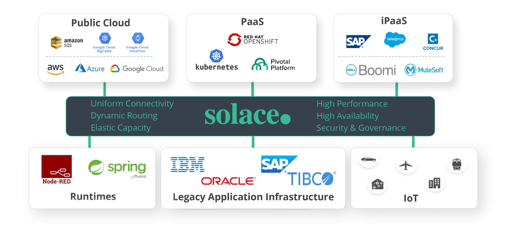
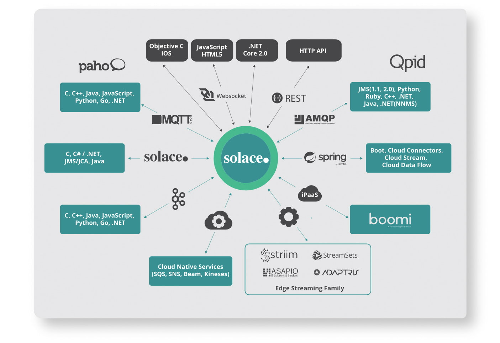
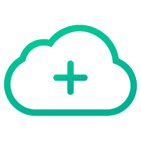
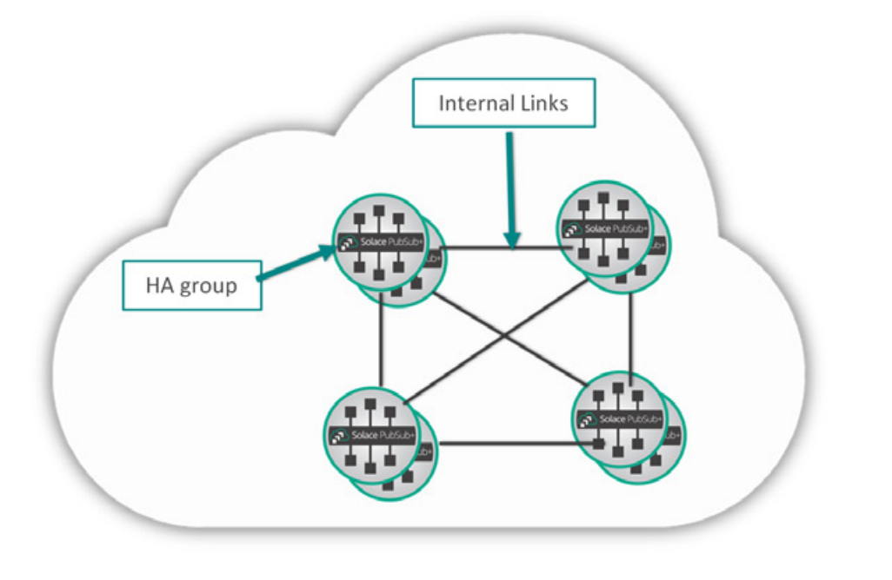
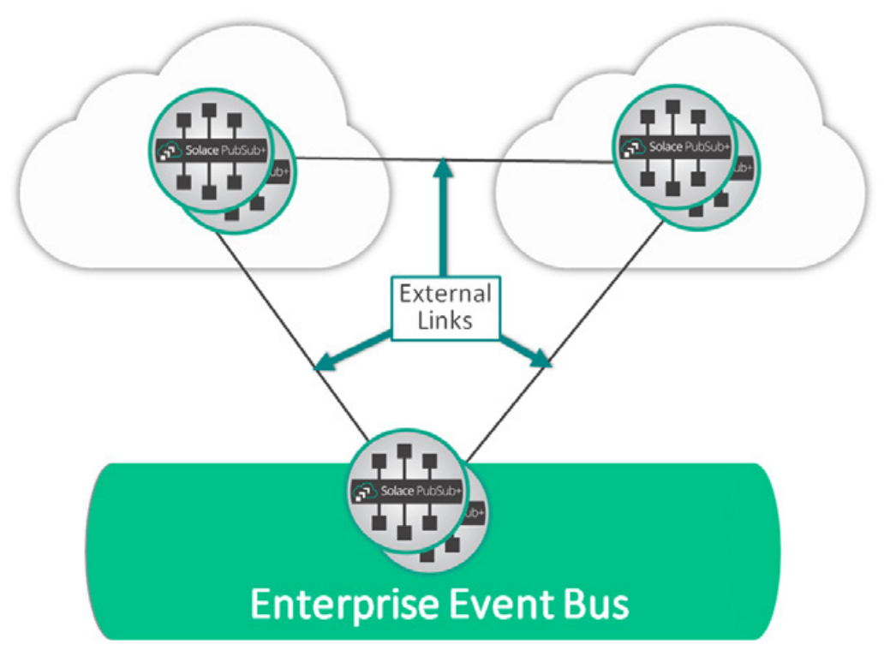
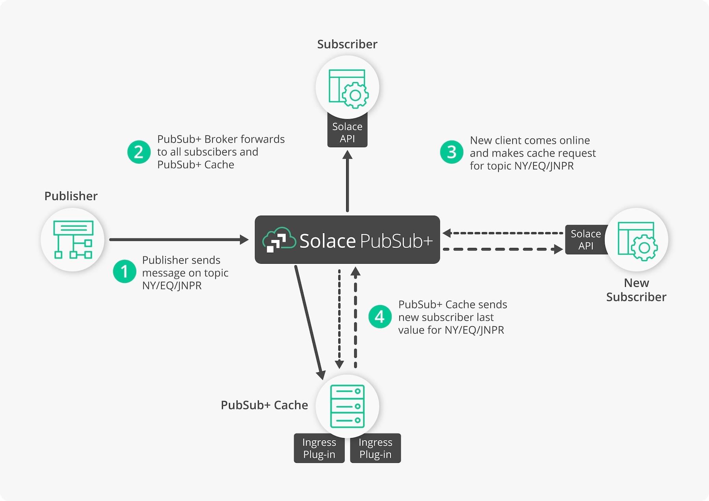

Event Broker的自我介绍(来自[官方资料](https://solace.com/products/event-broker/))：

> The only unified event broker technology available as run-anywhere software, purpose-built hardware, and a managed service that you can use together to stream events across your distributed enterprise.
>
> 唯一的统一事件代理技术，可作为随处运行的软件，专用硬件和托管服务使用，可以一起使用以跨整个分布式企业流式传输事件。

## 详细描述

- Power Your Event-Driven Transformation / 支持事件驱动转型

	Solace PubSub+ Event Broker有效地跨云，本地和物联网环境流式传输事件和信息。PubSub+ 中的“ +”表示它支持除发布/订阅（publish/subscribe）之外的各种消息交换模式，包括请求/答复（request/reply），流传输（streaming）和重播（replay），以及不同的服务质量，例如尽力而为（best effort）和有保证的传递。 它可以作为设备，软件和服务使用。 所有选项均提供相同的功能和管理体验。

- Build an Event Mesh and Share Data Everywhere / 建立 Event Mesh 并在任何地方共享数据

	PubSub+可让您连接事件代理以组成 Event Mesh —— Event Mesh 是一个架构层，可让您将事件从一个应用程序动态路由到任何其他应用程序，无论这些应用程序部署在何处（非云，私有云，公共云）），因此您可以连接和编排微服务，将事件从本地记录系统推送到云服务，并实现跨LoB和IoT的数字化转型。

	

- Unlock your data – no matter where it is / 解锁数据–无论在何处

	将我们的API用于最流行的编程语言，或者使用您喜欢的open API和协议，以便您可以连接到任何应用程序，采用同类最佳的消息传递方法，而永远不会被任何技术锁定，包括我们。

	

## 三种部署选项

- Cloud/云

	

	Event Broker:Cloud 是一项托管服务。 在几分钟内启动事件代理服务，扩展到任何级别，并将消息传递基础设施的运维留给我们。 提供免费服务。

- Software/软件

	

	Event Broker: Software 可以很容易的部署在您喜欢的云，容器和iPaaS / PaaS环境中。 并且有一个免费的生产就绪版本。

- Hardware

	

	Event Broker: Hardware 以紧凑的外形尺寸为您提供出色的性能和容量，并且具有交钥匙设备（turnkey appliance）的可运维性和较低的TCO。

## 优势所在

世界领先公司依赖PubSub+ Event Broker的更多原因：

> 您的系统已与业界最强大，经过考验的最可靠事件代理技术联系在一起，可以放心使用。 无论您具有本地记录的 ESB /消息系统，或者云原生服务和业务应用程序的本地数据库系统，还是甚至作为终端的Kafka集群，PubSub +都可以使您的架构体系结合在一起，从而受益于所有最佳技术。

详细展开：

- Management & Governance / 管理 & 治理
	* Centralized administration / 集中化管理
	* Authentication, authorization and encryption of assets and information / 资产和信息的认证、鉴权和加密
	* Powerful and proactive monitoring and alerting, including integration with existing monitoring tools / 强大而主动的监控和告警，包括和现有监控工具的集成
	* Built-in high availability and automated disaster recovery / 内置高可用性和自动灾难恢复
- Federated Architecture / 联邦架构
	* Routing across geographically distributed cloud and on-premises environments / 跨地理分布的云和本地环境进行路由
	* Dynamic, self-learning routing / 动态的，自我学习的路由
	* Fast, bandwidth-efficient routing over wide area networks / 在广域网上进行快速，高效带宽的路由
- Capacity and Performance / 容量和性能
	* 28 million non-persistent and 6 million persistent messages/second per appliance / 每个设备每秒2800万非持久消息和600万持久消息
	* 1.75 million non-persistent and 235,000 persistent messages/second per software broker / 每个软件代理每秒175万非持久消息和235,000持久消息
	* Up to 200,000 concurrent IoT connections per appliance / 每个设备最多200,000个并发IoT连接
- Advanced Messaging Capabilities / 高级消息能力
	* Message caching and replay / 消息缓存和重播
	* Sophisticated topics including wildcards / 复杂的主题，包括通配符
	* Prioritization, dead message queues / 优先级，死信队列
	* In-service upgrades / 服务中（不间断）升级

## DMR

DMR 指 Dynamic Message Routing / 动态消息路由。

> 介绍来自： https://solace.com/wp-content/uploads/2019/02/DMR.pdf

DMR 的 功能描述简单说是：

> Automatic distribution of events and subscriptions across many brokers to enable event mesh
> 
> 在众多代理之间自动分发事件和订阅，以启用 Event Mesh

随着业务的增长，应用程序和微服务将变得越来越复杂，基础设施将分布在各种越来越多的环境中，包括本地数据中心，私有云，公共云和物联网。这引入了对事件驱动架构（EDA）的需求，该架构可以跨众多位置和接口动态路由信息。

动态消息路由（DMR）是一种自我学习的路由机制，可自动在 PubSub+ 事件代理之间分发订阅和事件，因此您的应用程序和设备可以共享信息，就像它们已连接到同一事件代理一样，而无需了解任何应用程序正在创建或使用数据。

### 开启 Event Mesh

> Event Mesh 是一个架构层，它使来自一个应用程序的事件能够动态路由并被其他任何应用程序接收，无论这些应用程序部署在何处（非云，私有云或公共云）。 DMR通过连接环境内部或环境之间的 PubSub+ 事件代理来启用 Event Mesh。这使您可以轻松扩展环境中的容量或跨多个环境连接应用程序。

### 在云或数据中心内扩展容量

可以使用 DMR 快速增加任何云或数据中心内的代理容量。

使用DMR，您可以快速将新的HA组（Triplets / 三元组）连接到网络，以使它们自动获知所有订阅，包括持久性订阅和非持久性订阅，这样，感兴趣的消费者与其中任何一个相连都可以获取由任何生产者发布的事件。

### 启用分布式环境之间的数据流

可以使用DMR连接运行在不同云和数据中心中的代理，以便事件可以在它们之间流动。

一旦配置了双向DMR链接，订阅就会自动传播到企业网络中的所有其他代理。 然后，当应用程序发布事件时，事件会自动分发到世界各地的所有订阅的客户端。

## 监控

https://solace.com/products/monitor/

PubSub+ Monitor ：

> Proactively monitor your brokers so that you can keep your finger on the pulse of mission-critical applications.
>
> 主动监视代理，以便可以随时掌握关键任务的应用程序。
>
> Detect issues before they impact end users by using Monitor’s dashboards and alerts on critical broker metrics and events.
>
> 通过使用Monitor的仪表板和关键代理指标和事件的警报，在问题影响最终用户之前检测出问题。

### 获取需要的可行告警

根据预先配置的阈值和状态事件发送主动告警，以帮助运营团队定位开发问题并优化系统性能。

### 关键能力

- 改善正常运行时间

	通过允许解决和系统、VPN和客户端相关的事件的主动警报，提高正常运行时间，性能和安全性

- 持续优化

	通过收集代理指标和事件，并存储起来以进行分析和使用，来帮助优化性能

- 看到趋势

	提供历史趋势和可行的见解，以优化终端用户服务

- 避免集成麻烦

	消除了构建本地产品或购买第三方监控解决方案的需要

与现有的其他监视解决方案不同，PubSub + Monitor意味着：

- 没有更多的选择

	实时收集指标和状态事件

- 预配置

	包括许多预配置的阈值和警报

- 易于部署

	采用无代理架构，因此您可以快速滚动

- 一站式

	统一监视所有 PubSub+ 软件和硬件代理

## 消息缓存

https://solace.com/products/cache/

PubSub+ Cache的描述：

> A scalable and flexible last value cache solution that PubSub+ customers count on.
>
> PubSub+客户可信赖的可扩展且灵活的最终值缓存解决方案。
> 
> Group multiple PubSub+ Cache instances into a cluster to provide load balancing and fault tolerance.
>
> 将多个PubSub+缓存实例分组到一个群集中以提供负载平衡和容错能力。

"last value cache" 指的是缓存最后一个有效值。

为全球企业提供强大的缓存功能。

快速响应客户对最新发布数据的请求，同时每秒缓存数百万条消息。 将PubSub+缓存与PubSub+事件网格集成，并使用PubSub+ Manager对其进行管理。

Resiliency
Need a reliable solution with low latency? We’ve got you covered. Deploy PubSub+ Cache in clusters and we’ll take care of the rest.

Speed & Scalability
Service clients in real-time as your business grows in global and distributed environments. Cache almost 2 million messages/sec per instance and send up to 465,000 messages/sec to clients requesting cached messages. Add more clusters for even higher performance.

Flexibility
Use your Solace API of choice to connect your subscribers. Add message plug-ins to examine, process and apply custom business rules to the data before caching.