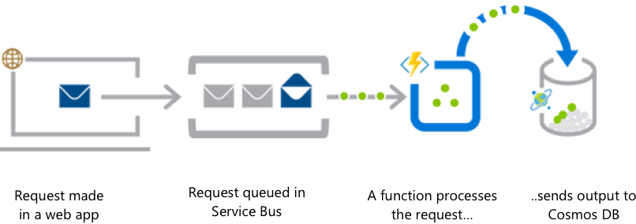
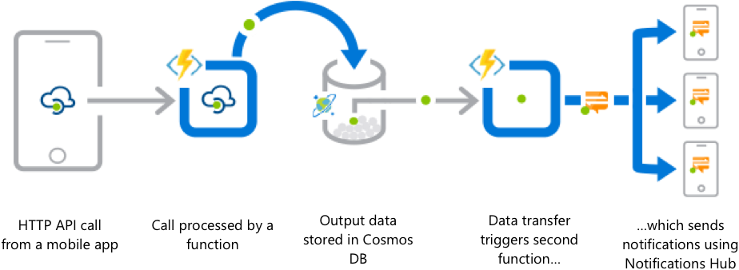
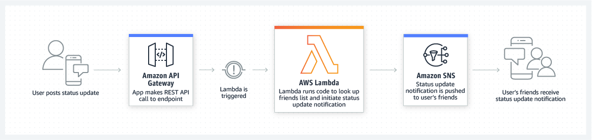
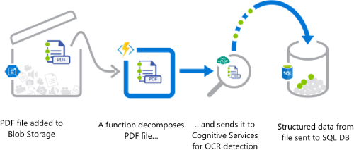
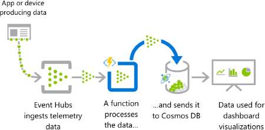
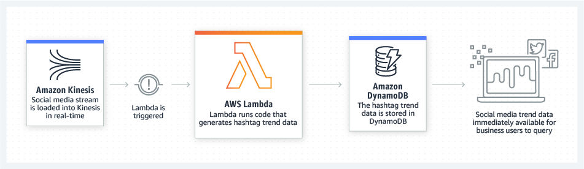
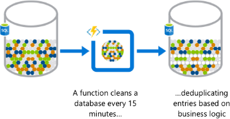
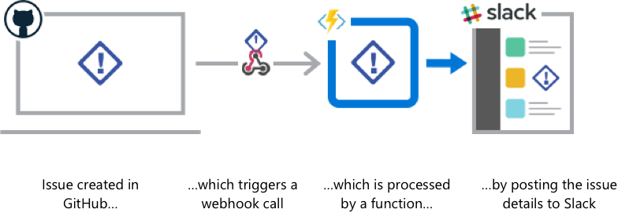

从aws lambda，azure functions和cncf serverless白皮书中整理出来的各种serverless典型使用场景。

## 后端

AWS Lambda：您可以使用 AWS Lambda 构建[无服务器](https://aws.amazon.com/cn/serverless/)后端，以处理 Web、移动、物联网 (IoT) 和第 3 方 API 请求。

### Web 应用程序后端

#### Azure的描述

从队列中获取在线订单，并进行处理，生成的数据保存在数据库中。

分析:

- 需要通过 Service Bus ，处理结果存储到Azure自家的 Cosmos DB。

#### Aws Lambda的描述

通过将 AWS Lambda 与其他 AWS 服务相结合，开发人员可以构建功能强大的 Web 应用程序，从而可自动扩展和收缩，并跨多个数据中心在高可用配置中运行，而无需在可扩展性、备份或多数据中心冗余方面执行任何管理工作。

实际案例：Bustle 使用 AWS Lambda 和 Amazon API Gateway 为其 Bustle iOS 应用程序和网站运行了一个无服务器后端。借助无服务器架构，Bustle 无需管理基础设施，因此每位工程师都能够集中精力构建新功能并进行创新。

场景分析：

- web请求通过REST走API Gateway进来，触发Lambda
- Lambda返回数据给请求
- 标准的对BaaS后端的请求

### 移动应用程序后端

#### Azure的描述

同事之间通过使用手机银行支付午餐费用：垫付午餐费用的人通过移动应用请求付款，这将在其他同事的手机上触发通知。

分析：

- 跳过了Service Bus，应该只是图上忽略了吧？
- 同样处理结果进Cosmos DB
- 存Cosmos DB时再次出发其他function
- 继续通过使用 Notifications Hub 发送通知

#### Aws Lambda的描述

您可以使用 AWS Lambda 和 Amazon API Gateway 构建后端，以验证和处理 API 请求。Lambda 能够轻松创造丰富、个性化的应用程序体验。

实际案例：Bustle 使用 AWS Lambda 和 Amazon API Gateway 为其 Bustle iOS 应用程序和网站运行了一个无服务器后端。借助无服务器架构，Bustle 无需管理基础设施，因此每位工程师都能够集中精力构建新功能并进行创新。

场景分析：

- 移动应用程序更新状态，通过REST请求走API Gateway进来，触发Lambda
- Lambda处理并发起状态更新通知，push给Amazon SNS

### IOT 后端

#### Aws Lambda的描述

您可以使用 AWS Lambda 构建无服务器后端，以处理 Web、移动、物联网 (IoT) 和第 3 方 API 请求。

场景分析：

- 传感器发送数据给Kinesis流数据处理平台
- Kinesis捕获传感器数据并流式传输传感器数据，触发Lambda

## 数据处理

Aws lambda：您可以使用 AWS Lambda 执行代码以响应数据更改、系统状态变化或用户操作等触发器。Lambda 可以由 S3、DynamoDB、Kinesis、SNS 和 CloudWatch 等 AWS 产品直接触发，也可以通过 [AWS Step Functions](https://aws.amazon.com/cn/step-functions/) 编排到工作流程中。您可借此构建各种实时的[无服务器](https://aws.amazon.com/cn/serverless/)数据处理系统。

### 数据库更改或更改数据捕获（CDC）

CNCF白皮书：在此场景中，当从数据库插入，修改或删除数据时调用function。在这种情况下，它的功能类似于传统的SQL触发器，几乎就像是与主同步流并行的副作用或动作。其结果是执行一个异步逻辑，可以修改同一个数据库中的某些内容（例如记录到审计表），或者依次调用外部服务（例如发送电子邮件）或更新其他数据库，例如 DB CDC（更改数据捕获）用例的情况。 由于业务需要和处理变更的服务分布的原因，这些用例的频率以及对原子性和一致性的需要可能不同。

例子包括：

- 审核对数据库的更改，或确保它们满足特定质量或分析标准以进行可接受的更改。
- 在输入数据时或之后不久自动将数据翻译为其他语言。

### 实时文件处理

#### Azure的描述

病历以 PDF 文件形式安全上传。然后使用 OCR 检测分解和处理该数据，并将其添加到数据库以便查询。

分析：

- 触发来自Blob Storage
- function进行处理，转交给OCR处理的服务
- 再将结构化信息存储在数据库中

#### Aws Lambda的描述

您可以使用 Amazon S3 触发 AWS Lambda，以便在上传数据后立即对它们进行处理。例如，您可以使用 Lambda 实时创建缩略图、转换视频代码、建立文件索引、处理日志、验证内容以及聚合和筛选数据。

实际案例：西雅图时报利用 AWS Lambda 来调整图像大小，以便于在不同的设备（如台式机、平板电脑和智能手机）上查看。

场景分析：

- 相机拍照，图片上传，触发Lambda （同样是Blob Storage触发）
- 对图片进行处理如修改大小
- 但这里没有说处理之后的图片如何存储，应该也是类似的存储在s3中

### 实时流式处理

#### Azure的描述

从大量云应用收集到大量遥测数据。近乎实时地处理该数据，并将其存储到 DB 中，供分析仪表板使用。

分析：

- 应用或者设备产生数据，作为遥测信息收集
- function处理遥测数据，将结果发送给 Cosmos DB
- 按照实际经验，这里的function应该会是多次流处理，不会简单的一个function

#### Aws Lambda的描述

您可以使用 AWS Lambda 和 Amazon Kinesis 处理实时流数据，从而跟踪应用程序活动、处理事务处理顺序、分析单击数据流、整理数据、生成指标、筛选日志、建立索引、分析社交媒体以及遥测和计量 IoT 设备数据。

实际案例：Localytics 可实时处理数十亿个数据点，并使用 Lambda 来处理存储在 S3 中或从 Kinesis 进行流式处理的历史和活动数据。

场景分析：

- 社交媒体数据实时上载，触发Lambda
- Lambda生成趋势数据，存储到 DynamoDb
- 趋势数据可以被立即查看

### 提取、转换、加载

#### Aws Lambda的描述

您可以使用 AWS Lambda 针对 DynamoDB 表中的每个数据更改执行数据验证、筛选、排序或其他转换，并将转换后的数据加载到其他数据存储。

实际案例：Zillow 使用 Lambda 和 Kinesis 实时跟踪移动指标子集。凭借 Kinesis 和 Lambda，我们得以在两周内开发和部署一套成本高效的解决方案。

场景分析：

- 订单操作更新数据库，触发Lambda
- Lambda进行转换，将数据存储到数据仓库

##　其他

### 计划任务的自动化

#### Azure的描述

每 15 分钟对客户数据库执行一次分析，检查是否有重复条目，避免将多个通信发送给同一个客户。

分析：

- function定时调度，定期清理数据

#### CNCF白皮书的描述

批处理作业或计划任务: 每天只需几分钟就能以异步方式进行强大的并行计算，IO或网络访问的作业非常适合serverless。作业可以在以弹性方式运行时有效地消费他们所需的资源，并且在不被使用的当天剩余时间内不会产生资源成本。

例子包括：

- 计划任务可以是每晚运行的备份作业。
- 并行发送许多电子邮件的作业会扩展function实例。

### 扩展 SaaS 应用程序

#### Azure的描述

SaaS 解决方案通过 webhook（可通过 Functions 实现）提供扩展性，以自动执行某些工作流。

分析：

- 外部活动，通过web hook触发function
- function进行处理，或者通过事件继续触发其他function

### 持续集成管道

CNCF白皮书：传统的CI管道包括一个构建从属主机池，它们处于空闲等待以便分派作业。Serverless是一种很好的模式，可以消除对预配置主机的需求并降低成本。构建作业由新代码提交或PR合并触发。 调用function来运行构建和测试用例，仅在所需的时间内执行，并且在未使用时不会产生成本。这降低了成本，并可通过自动扩展来减少瓶颈以满足需求。

### 业务逻辑

CNCF白皮书：当与管理和协调function一起部署时，在业务流程中执行一系列步骤的微服务工作负载的编排是serverless计算的另一个好用例。执行特定业务逻辑的function（例如订单请求和批准，股票交易处理等）可以与有状态管理器一起安排和协调。来自客户端门户的事件请求可以由这样的协调function提供服务，并传递给适当的serverless function。

例子包括：

交易台，处理股票市场交易并处理客户的交易订单和确认。协调器使用状态图管理交易。初始状态接受来自客户端门户的交易请求，并将请求传递给微服务function以解析请求并验证客户端。随后的状态根据买入或卖出交易指导工作流，验证基金余额，股票代码等，并向客户发送确认。在从客户端接收到确认请求事件时，后续状态调用管理交易执行的function，更新账户，并通知客户完成交易。

### 聊天机器人

CNCF白皮书：与人类交互不一定需要毫秒级别的响应时间，并且在许多方面，稍微延迟让回复人类的机器人对话感觉更自然。因此，等待从冷启动加载function的初始等待时间可能是可接受的。当添加到Facebook，WhatsApp或Slack等流行的社交网络时，机器人可能还需要具有极高的可扩展性，因此在PaaS或IaaS模型中预先设置一个永远在线的守护程序，以预测突然或高峰需求，可能不会有作为serverless方法的高效或成本效益。

例子包括：

- 支持和销售机器人插入到大型社交媒体服务，如Facebook或其他高流量网站。
- 消息应用程序Wuu使用Google Cloud Functions使用户能够创建和共享在数小时或数秒内消失的内容。
- 另请参阅下面的HTTP REST API和Web应用程序。