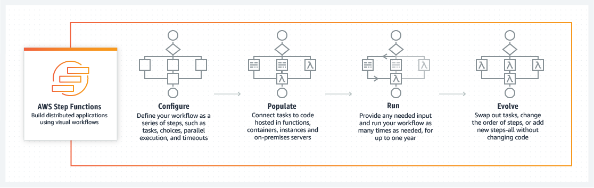

## 介绍

https://aws.amazon.com/cn/step-functions/

### 功能介绍

Step Function官方网站的介绍是：**使用可视工作流来构建分布式应用程序**

> AWS Step Functions 让您将多个 AWS 服务协调为无服务器工作流，以便您可以快速构建和更新应用程序。使用 Step Functions，您可以设计和运行将 AWS Lambda 和 Amazon ECS 等服务整合到功能丰富的应用程序中的工作流。工作流由一系列步骤组成，一个步骤的输出充当下一个步骤的输入。使用 Step Functions，应用程序开发更简单、更直观，因为它将工作流转换为易于理解、易于向其他人说明且易于更改的状态机示意图。您可以监控执行的每个步骤，这意味着您可以快速识别并解决问题。Step Functions 可以自动触发和跟踪各个步骤，并在出现错误时重试，因此您的应用程序能够按照预期顺序执行。

来自Lambda网站对 Step Function 的介绍：

> 可以通过使用 [AWS Step Functions](https://aws.amazon.com/cn/step-functions/) 构建工作流来协调多个 AWS Lambda 函数，用于复杂或长时间运行的任务。
>
> 通过 Step Functions，可以定义使用顺序、并行、分支和错误处理步骤来触发 Lambda 函数集合的工作流。借助 Step Functions 和 Lambda，可以为应用程序和后端构建有状态、长时间运行的进程。

## 优势

- 快速构建和更新应用程序

	AWS Step Functions 允许您构建可**快速将业务需求转换为技术需求**的可视化工作流。您可以在大约几分钟内构建应用程序，并且当需求变化时，您可以交换或重新组织组件而无需自定义任何代码。

- 提高弹性

	AWS Step Functions 为您管理状态、检查点和重启，以确保您的应用程序按照预期逐步执行。内置 try/catch、重试和回滚功能自动处理错误和异常。 

- 编写更少代码

	AWS Step Functions 为您管理应用程序的逻辑，并实施基本基元，例如分支、并行执行和超时。这删除了可能在微服务和函数中重复的额外代码。

## 工作原理

## 使用案例

> 在aws的博客网站中有很多内容，可以作为案例研究，虽然有广告嫌疑，但是还是很有参考价值
>
> https://aws.amazon.com/cn/blogs/architecture/
>
> 后面有时间再做一个详细的使用案例收集和场景分析，以判断是否有合适的场景可以适用于我们自己的产品

### 数据处理

Step Functions 可帮助确保长时间运行的多个 ETL 作业按顺序执行并成功完成，而非手动编排这些作业或维护单独的应用程序。您还可以使用 Step Functions 标准化 Machine Learning 训练工作流以提高 Machine Learning 模型的准确度。

备注：ETL和Machine Learning的场景

案例：官方案例里面有一个ETL的案例，[Orchestrate multiple ETL jobs using AWS Step Functions and AWS Lambda](https://aws.amazon.com/cn/blogs/big-data/orchestrate-multiple-etl-jobs-using-aws-step-functions-and-aws-lambda/)

### 自动执行任务

Step Functions 提供了常规部署、升级、安装和迁移的可审核自动化。您可以使用 Step Functions 来轻松地自动执行周期性任务，例如补丁管理、基础设施选择和数据同步，并且 Step Functions 将自动扩展、响应超时和重试失败的任务。

### 使整体实现现代化

​通过使用 Step Functions 将一些任务与代码库的其余部分分离，您可以处理整体应用程序向作为一系列小步骤的微服务的转换。这样，您可以安全地按照自己的进度清理业务关键型代码，而不会中断操作，同时可继续交付新功能。

备注：这是在微服务改造期间剥离部分功能？

### 应用程序编排

使用 Step Functions 将多个 AWS Lambda 函数组合到响应式无服务器应用程序和微服务中，而不必为工作流逻辑、并行进程、错误处理、超时或重试编写代码。您还可以编排在​ Amazon EC2 实例、容器或本地服务器上运行的数据和服务。

备注：这才是真正的函数编排，组合现有多个函数成为一个新的函数或者服务