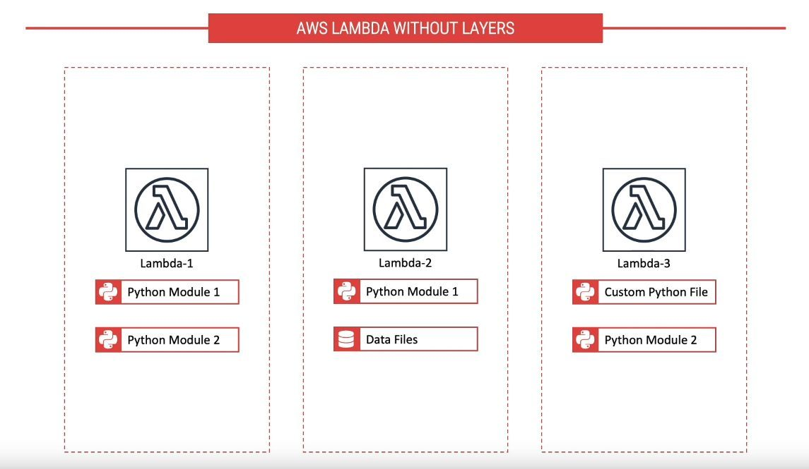
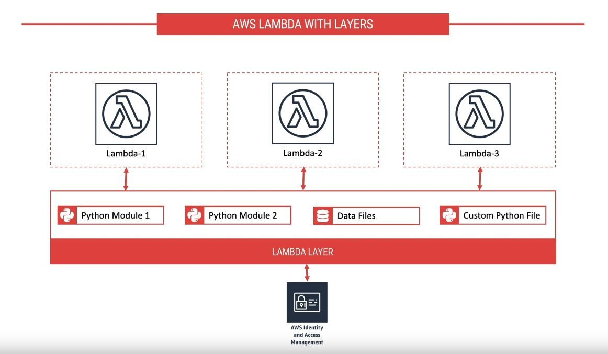
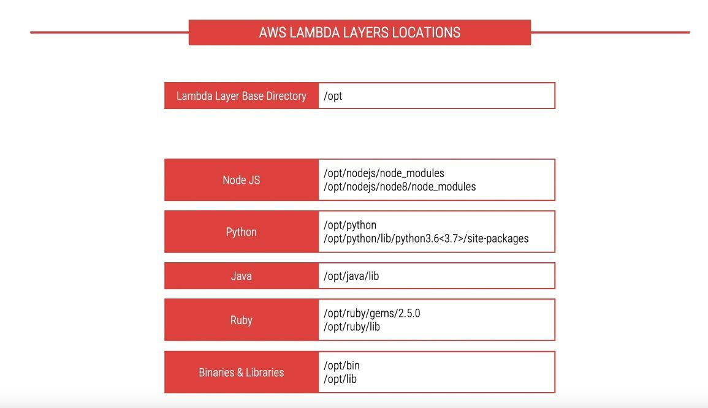

## 背景

asw 在2018年11月推出两个新功能，声称将使无服务器开发变得更加容易：

- Lambda Layers：一种集中管理在多个函数之间共享代码和数据的方法
- Lambda Runtime API，一个使用任何编程语言或特定语言版本的简单接口，用于开发函数

这两个功能可以一起使用：Runtime可以作为Layer共享，以便开发人员可以在创建Lambda函数时选择它们并使用自己喜欢的编程语言。

## Lambda Layers介绍

构建serverless应用程序时，通常会在Lambda函数之间共享代码。可以是由多个函数使用的自定义的代码，或者是用来简化业务逻辑实现的标准库。



以前，必须将此共享代码与所有使用它的函数一起打包和部署。现在，您可以将常用组件放在ZIP文件中并将其作为Lambda Layer上传。您的函数代码不需要更改，并且可以像通常那样引用Layer中的库。



可以对Layer进行版本控制以管理多个更新，每个版本都是不可变的。删除版本或版本的使用权限被撤销时，之前使用它的函数将继续有效，但您将无法创建新的函数。

在函数的配置中，最多可以引用五个Layer，其中一个Layer可以选择是runtime。调用该函数时，将按照您提供的顺序在 /opt 中安装Layer。顺序很重要，因为Layer都是在同一路径下提取的，因此每个Layer都可能覆盖前一个Layer。这个方式可用于自定义环境。例如，第一个Layer可以是rumtime，第二个Layer可以添加所需库的特定版本。



图层可以在AWS账户内使用，在账户之间共享，也可以与广泛的开发人员社区公开共享。

#### 来自官方文档的介绍

您可以配置Lambda函数以Layer的形式获取其他代码和内容。Layer是ZIP文件，包含库，[自定义运行时](https://docs.aws.amazon.com/lambda/latest/dg/runtimes-custom.html)或其他依赖。使用Layer，您可以在函数中使用库，而无需将它们包含在部署包中。

使用Layer可以使您的部署包保持较小，从而使开发更容易。您可以避免在函数代码安装和打包依赖时可能发生的错误。对于Node.js，Python和Ruby函数，[在Lambda控制台中开发函数代码](https://docs.aws.amazon.com/lambda/latest/dg/code-editor.html)，可以将部署包保持在3 MB以下。

### Layer的优点

- 实现关注点分离：分离业务逻辑和依赖
- 使函数代码更小，更专注于想要构建的内容
- 加快部署速度，因为必须打包和上载的代码更少了，并且可以重用依赖

### 使用方式

详见官方文档：

https://docs.aws.amazon.com/lambda/latest/dg/configuration-layers.html

注意：必须通过提供Layer版本的完整ARN来指定要使用的每个图层的版本。

```bash
$ aws lambda update-function-configuration --function-name my-function \
--layers arn:aws:lambda:us-east-2:123456789012:layer:my-layer:3 \
arn:aws:lambda:us-east-2:210987654321:layer:their-layer:2
```


## Lambda Runtime API

可以在创建或更新函数时选择自定义runtime。

该函数必须包含（在其代码或Layer中）一个名为bootstrap的可执行文件，负责代码（可以使用任何编程语言）和Lambda环境之间的通信。

运行时bootstrap使用简单的基于HTTP的接口来获取新调用的事件有效负载，并从函数返回响应。有关接口端点和函数处理程序的信息作为环境变量共享。

为了执行代码，您可以使用可在Lambda执行环境中运行的任何内容。例如，您可以为您选择的编程语言提供解释器。

只有要管理或发布自己的rumtime时，才需要了解Runtime API的工作原理。作为开发人员，您可以快速使用作为Layer共享的runtime。

Runtime API是我们在Lambda中支持新语言的未来。

使用运行时和图层无需额外费用。

### 参考资料

介绍文章：

- [New for AWS Lambda – Use Any Programming Language and Share Common Components](https://amazonaws-china.com/cn/blogs/aws/new-for-aws-lambda-use-any-programming-language-and-share-common-components/)
- [AWS Lambda Layers](https://docs.aws.amazon.com/lambda/latest/dg/configuration-layers.html) @Lambda developer guide
- [Custom AWS Lambda Runtimes](https://docs.aws.amazon.com/lambda/latest/dg/runtimes-custom.html) @Lambda developer guide

视频：

- [AWS Lambda Layers - How to use them in Lambda Functions](https://www.youtube.com/watch?v=ebhcs-9FYJA): 上面几张简单图片来自该视频，这个视频还带有一个完整的 [demo](https://github.com/pdomala/lambda-layers-demo)
- [AWS Builders' Day | re:Invent Deep Dive on Lambda Layers and Runtime API](https://www.youtube.com/watch?v=zq-JsNC0LPU)

一些关于使用的教程文章：

- [How to use AWS Lambda Layers](https://medium.com/devopslinks/how-to-use-aws-lambda-layers-f4fe6624aff1)： 以ruby为例