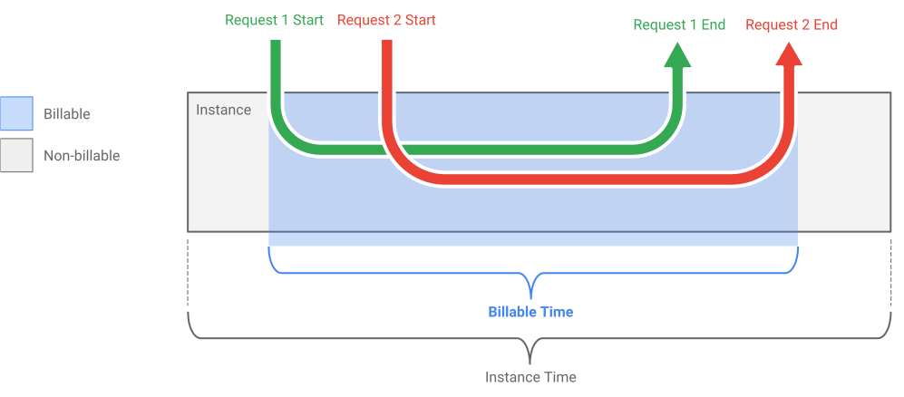

## Cloud Run介绍

> > 备注：来自 [cloudrun官方网站首页](https://cloud.google.com/run/) 的介绍，虽然有广告味道，不过还是能得到一些信息的。 

首先是 Cloud Run 的简短介绍：

> Run stateless HTTP containers on a fully managed environment or in your own GKE cluster.
>
> 在完全托管的环境或者自己的GKE集群中运行serverless HTTP容器。

### 介绍内容

- 将serverless带入容器

	Cloud Run是一个托管计算平台，使您可以运行通过HTTP请求可调用的无状态容器。Cloud Run是serverless的：它抽象出所有基础设置管理，因此您可以专注于最重要的事情 - 构建出色的应用。它由 [Knative构建](https://knative.dev/)，允许您选择运行容器的方式：使用Cloud Run的完全托管，或者在GKE上使用Cloud Run运行的Google Kubernetes Engine集群。

- 容器在几秒钟内生产

	许多serverless平台有对语言，库的支持限制，甚至限制编码方式。通过允许轻松部署监听HTTP请求的任意serverless容器，Cloud Run使您能够以自己的方式编写代码。容器提供工作负载的灵活性和可移植性。使用Cloud Run，可以使用喜欢的依赖项和工具，以喜欢的语言构建出色的应用程序，并在几秒钟内完成部署。

- 原生serverless

	Cloud Run使您可以运行serverless HTTP工作负载，而不必操心服务器。它抽象出所有基础设施管理，例如配置和管理服务器，因此您只关注编写代码。根据流量，它几乎可以立即自动从零开始向上和向下扩展，因此您无需担心规模配置。Cloud Run还仅针对使用的资源（计算到最接近的100毫秒）收费，因此您永远不必为超额配置的资源付费。

- 一致体验

	将具有开发人员一致体验的serverless容器部署到完全托管的环境或您自己的GKE集群。Knative是一种基于Kubernetes的开放API和运行时环境，可以让您自由地在不同的环境和平台上移动工作负载：GCP完全托管，GKE，或Knative运行的任何地方。

点评：cloud run的介绍，强调的重点是"Container on serverless"，而不是以往的 "Function on Serverless"。cloud run 支持的是基于容器的工作负载，因此适用范围远远大于传统的FaaS。其次强调的是一致性的体验，在不同平台的可移植性，含蓄的表达了不会出现供应商和平台Lock-In。

### 特性

- 开发简单

	简单的命令行和用户界面，可以快速部署和管理服务

- 快速自动缩放

	Cloud Run会根据流量自动从零向上或向下扩展到N. 在GKE上运行时，自动扩展限制在GKE集群的容量范围内。

- 托管式

	无需管理基础设施：一旦部署，Cloud Run将管理您的服务，以便您可以安然入睡。

- 任何语言/库/二进制文件

	使用您选择的编程语言，任何语言或操作系统库，甚至自带二进制文件。

- 利用容器工作流程和标准

	容器已成为打包和部署代码及其依赖项的标准。Cloud Run与容器生态系统配对很好：[Cloud Build](https://cloud.google.com/cloud-build/)，[Container Registry](https://cloud.google.com/container-registry/)，Docker。

- 冗余

	Cloud Run服务是区域性的，可跨多个区域自动复制

- 集成的日志和监控

	与Stackdriver监控，日志和错误报告的集成，开箱即用，确保应用的健康。

- 建立在Knative上

	Cloud Run构建于[Knative](https://knative.dev/)开源项目之上，可实现工作负载的跨平台可移植性。

- 自定义域名

	将您的服务映射到您自己的域名。

点评：和其他serverless托管服务相比，亮点主要还是对容器的支持带来的负载适用范围广泛。

### 选择适合的平台

Cloud Run使您可以灵活地在Google Cloud或Google Kubernetes Engine上运行服务。如果您已经在使用GKE，则Cloud Run可以部署到您的群集中，允许访问自定义计算机类型，额外的网络和GPU支持，以扩展Cloud Run服务的运行方式。最棒的是您可以稍后轻松改变主意，从Cloud Run切换到在GKE上的Cloud Run，反之亦然，而无需重新实现您的服务。

|            | Cloud Run                                                  | GKE上的Cloud Run                                        |
| :--------- | ---------------------------------------------------------- | ------------------------------------------------------- |
| 价钱       | 按使用付费（见下文）。                                     | 作为Kubernetes Engine的一部分提供。定价将在GA之前确定。 |
| 机器类型   | 每个实例一个vCPU，可以更改内存                             | GKE上的标准或自定义机器类型，包括GPU。                  |
| 身份和政策 | 管理允许调用服务的身份（或允许未经身份验证的调用）。       | 将服务发布到Internet或仅将其提供给群集或VPC网络。       |
| 联网       | 无法访问VPC /计算引擎网络。服务不是Istio服务网格的一部分。 | 访问VPC /计算引擎网络。服务参与Istio服务网格。          |
| 网址       | 自动提供URL和SSL证书                                       | 自定义域仅包含手动SSL证书。                             |

点评：cloud run是完全托管的版本，因此可以按照使用付费，可以提供各种集成，甚至，实际托管的knative实现很有可能和开源的 knative 不同。而GKE上的Cloud Run就没有这个自由度了，应该是用开源版本的 knative。

### 价钱

- Cloud Run

  仅为使用的资源收取费用，计费到最近的100毫秒。

- Cloud Run on GKE pricing

	GKE上的Cloud Run是Google Kubernetes Engine集群的附加组件。Cloud Run on GKE部署的工作量包含在您的GKE定价中。GRE上Cloud Run的最终定价将在GA之前确定。Google Kubernetes Engine的价格基于群集的预配资源。

## Cloud Run计费模型

Cloud Run 的计费模型也颇具创新性：它不像 Fargate 那样完全按请求数目计费，而是将所有并发的请求算在一个计费单位内，这有望大大减低用户需要支付的成本。

https://cloud.google.com/run/pricing

Cloud Run仅针对您使用的资源收取费用，四舍五入到最接近的100毫秒。请注意，每个资源都有免费配额。总Cloud Run帐单将是定价表中资源的总和。

免费配额每月重置; 您只需支付超过免费配额的使用费。

### 可计费时间

对于给定的容器实例，可计费时间发生时

- 容器实例正在启动
- 容器实例正在处理至少一个请求

只有在容器实例上请求处于活动状态时分配的CPU和内存才会收费，并向上舍入到最接近的100毫秒。

如果容器实例同时收到许多请求，则可计费时间从第一个请求的开始开始，到最后一个请求结束时结束，如下图所示：

对于运行在GKE上的Cloud Run，由于GKE上的Cloud Run是Google Kubernetes Engine的附加组件。群集中运行的工作负载包含在Google Kubernetes Engine定价中。GRE上Cloud Run的最终定价将在GA之前确定。
