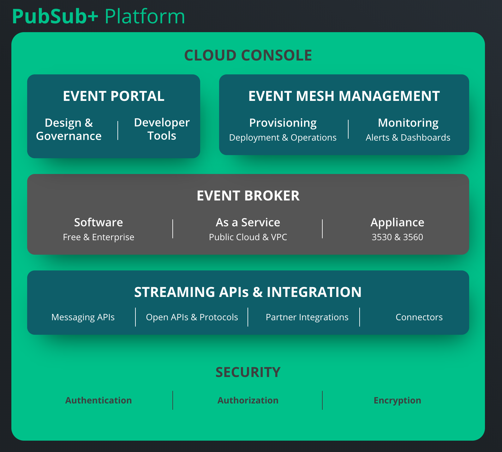

## Solace介绍

官方网站：https://solace.com/ ， 口号：

> “Building the digital backbone for real-time enterprises.”
> 为实时企业构建数字骨干

描述语：

> Everything you need to get your business events streaming on an event mesh, plus what you need to discover, manage and govern them.
>
> 在 Event Mesh 上流式传输业务事件所需的一切，以及发现、管理和管理它们所需的一切。

## pubsub+

Pubsub+ 号称 "The complete event management platform / 完整的事件管理平台"：

### Event Broker

> At the run-time data movement level, PubSub+ event brokers power an event mesh, a modern messaging layer that can be deployed across every environment and component of the distributed enterprise, to stream events across them all.
>
> 在实时数据移动级别，PubSub+ Event Broker 为 Event Mesh 提供支持，Event Mesh 是一种现代的消息传递层，可以在分布式企业的每个环境和组件中进行部署，并在他们之间流式传输事件。

### Event Mesh Management

> To manage the infrastructure, PubSub+ event mesh management and monitoring solutions make it easy to deploy event brokers, create event meshes, and optimize the health and performance of the event-driven system.
>
> 为了管理基础设施，PubSub+ Event Mesh 管理和监视解决方案可以简化部署Event Broker ，创建 Event Mesh 以及优化事件驱动系统的运行状况和性能。

### Streaming Intergrations

> At the integration level, PubSub+ APIs and Streaming Integrations provide a variety of on-ramps and off-ramps to the event mesh, including support for open standard protocols and APIs (MQTT, AMQP, JMS, REST) as well as proprietary messaging APIs to connect legacy and modern applications, edge streaming technologies (StreamSets, Striim, Adaptris, ASAPIO, Dell Boomi) to integrate 3rd party applications and connectors for technologies like Apache Kafka.
>
> 在集成级别上，PubSub+ API 和 Streaming 集成为 Event Mesh 提供了各种渠道，包括支持开放标准协议和API（MQTT，AMQP，JMS，REST），以及支持专有消息API以连接旧的和现代的应用程序，支持边缘流技术（StreamSets，Striim，Adaptris，ASAPIO，Dell Boomi）以为Apache Kafka等技术集成第三方应用程序和连接器。

### Event Portal

> At the application level, PubSub+ Event Portal gives developers and architects tools to design, describe and discover events within their system, and to see the relationships between applications and events, making event-driven applications and microservices easier to design, deploy and evolve.
>
> 在应用程序级别，PubSub+ Event Portal为开发人员和架构师提供了工具来设计，描述和发现系统中的事件，并查看应用程序和事件之间的关系，从而使事件驱动的应用程序和微服务更易于设计，部署和发展。

### Security

> PubSub+ Platform enables messaging architectures that deliver consistent multi-protocol client authentication and authorization security across the enterprise, deeply integrated with enterprise authentication services using a minimal set of components.
>
> PubSub+ 平台支持使消息传递架构能够在整个企业范围内提供一致的安全性，包括多协议客户端身份验证和授权，并使用最少的组件集与企业身份验证服务进行了深度集成。

### Cloud Console

> All of the above features and capabilities can be accessed through a single Cloud Console with a single log-in, making it easy for architects, developers and other users to work, collaborate and drive the enterprise’s EDA mission forward.
>
> 上述所有特性和能力都可以通过单一登录的单个 Cloud Console 进行访问，从而使架构师，开发人员和其他用户可以轻松地工作，协作并推动企业的EDA远景向前发展。