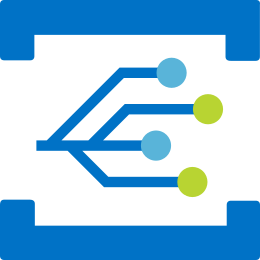
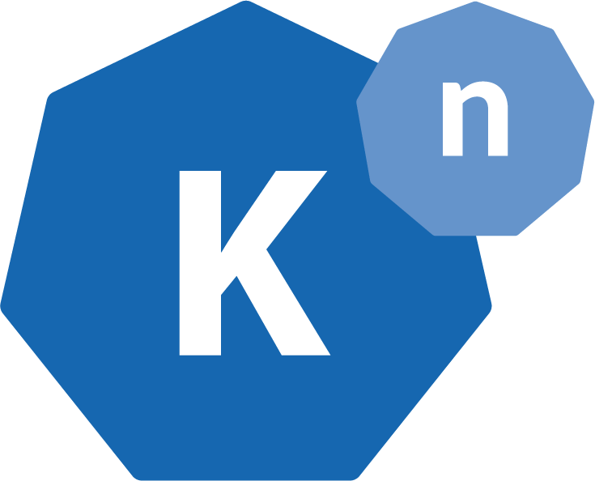
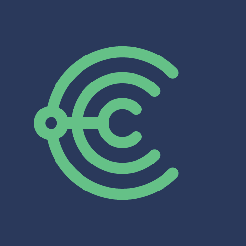

## 介绍

CloudEvents是一种以通用方式描述事件数据的规范。CloudEvents旨在简化跨服务，平台及其他方面的事件声明和发送。CloudEvents　最初由　CNCF Severless 工作组提出。

> A specification for describing event data in a common way
>
> 以通用方式描述事件数据的规范

### 为什么需要CloudEvents？

事件无处不在，然而事件发布者对事件的描述却往往不尽相同。

- 一致性：缺乏通用的事件描述方式，意味着开发人员必须为每个事件源编写新的事件处理逻辑。
- 无障碍环境：没有通用的事件格式意味着没有通用的库、工具和基础设施来跨环境投递事件数据。CloudEvents提供了Go、JavaScript、Java、C#、Ruby和Python的SDK，可用于构建事件路由器、跟踪系统和其他工具。
- 可移植性：整体上阻碍了我们从事件数据中实现的可移植性和生产力。

### 什么是CloudEvents？

CloudEvents 是一个以通用方式描述事件数据的规范。CloudEvents旨在大幅简化跨服务、跨平台的事件声明和投递。

CloudEvents是一项新的工作，目前仍在积极开发中。然而，它的工作小组已经收到了令人惊讶的行业兴趣，从主要的云提供商到流行的SaaS公司都有。该规范现在由云原生计算基金会（Cloud Native Computing Foundation/CNCF）负责。

CloudEvents是通过CNCF的Serverless工作组组织的。

### 1.0版本

2019年10月24日，CloudEvents项目取得了两项重大成果。第一，CNCF的技术监督委员会批准该项目成为 "孵化器 "项目（从而使其从CNCF的 "沙盒"毕业）。第二，CloudEvents规范发布了1.0版本!

这是该规范的第一个主要版本，代表了整个serverless社区中一个真正伟大的团队两年来的努力工作。我们已经有几乎所有主要的云提供商参与其中，还有一些 "终端用户 "公司以及许多个人参与者，他们都在努力工作以制作出一个规范，希望在这一里程碑式的发展过程中，能够继续得到更多的采用。

除了核心的CloudEvents规范外，还有Primer和协议及格式规范，所有这些都可以在GitHub repo中找到。此外，还有六种不同的SDK-Go、JavaScript、Java、C#、Ruby和Python，帮助生产和消费CloudEvents。

CNCF Serverless工作组将决定下一步的工作重点（例如，额外的CloudEvents相关活动，或者解决社区正在经历的其他互操作性痛点）。所以，如果你有兴趣，请加入每周的定期电话会议。此外，还有工作流规范方面的工作正在进行中。

## 历史

CNCF Severless 工作组最初是由 CNCF 技术监督委员会创立的，旨在调查 Serverless 技术和指导 CNCF 在本领域下一步可能展开的相关工作的建议。其中一项建议是创建一个通用的 Event Format，以在不同云供应商提供的Function 之间实现可移植性和事件流处理的互操作性。CloudEvents 规范因此被创建出来。

尽管 CloudEvents 的工作最初是作为 Serverless 工作组的一部分开展的，当规范到达 v0.1 里程碑之后，TOC 批准了 CloudEvents 成为一个独立的 CNCF 沙盒项目。

TODO：补充发展过程。

## 集成

|                                                              |                              | 支持情况                                                     |
| ------------------------------------------------------------ | ---------------------------- | ------------------------------------------------------------ |
|   | Azure Event Grid             | Event Grid原生支持CloudEvents v1.0 JSON实现中的事件和HTTP协议绑定。 |
|             | Knative Eventing             | 所有由Knative Eventing service产生和消费的事件数据均符合CloudEvents标准 |
|  | Serverless.com Event Gateway | 函数从事件网关接收的所有事件数据均符合 CloudEvents 标准      |
|           | OpenFaaS                     | CloudEvent事件是OpenFaaS函数的众多可用触发器之一。           |
|              | Choria                       | Choria 编排系统发出的所有生命周期和自主代理事件都符合 CloudEvents 的标准。 |
|             | Oracle Cloud                 | Oracle云基础设施事件服务实现了CloudEvents                    |

